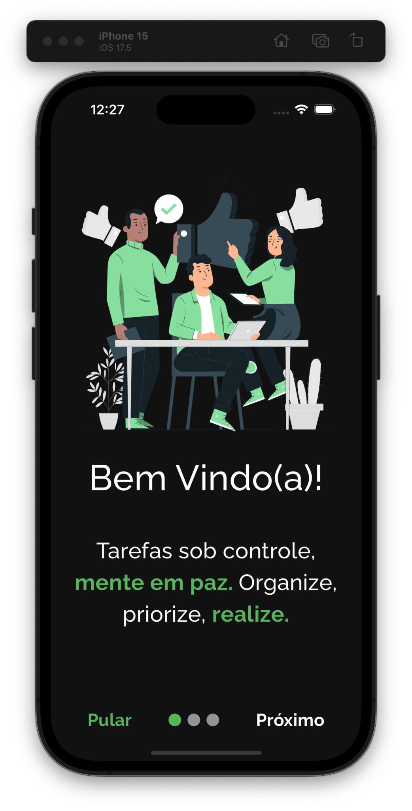

<h2 align="center">To Do App<h2>
<p align="center">
    
</p> 

   <h2>Topics 📋</h2>

  <p>
   
   - [About 📖](#about-)
   - [Preview 📱](#preview-)
   - [Technologies Used 👨🏽‍💻](#---technologies-used----)
   - [How to Use 🤔](#how-to-use-)
   </p>

   <h2>About 📖</h2>
   
   <p>
    Meet To Do App, the ideal app for managing your daily tasks! With it, you can create, edit, delete, and filter your tasks in a simple and practical way. Take advantage of local storage with SQLite for offline access and synchronization with the cloud database via Firestore to keep your tasks always up to date on any device, along with full authentication provided by Firebase. The "Doc.md" file in the project root folder contains all the development and architecture documentation for the application.
   </p>

---

   <h2>Preview 📱</h2><br>

   <p a>
      
       
       
   </p>

---

 <h2>
   Technologies Used 👨🏽‍💻
   </h2>
   
- **bloc** -> State manager.
- **freezed** -> Code generator for bloc state and event classes.
- **sqflite** -> SQL database used to cache data in the device's memory.
- **firebase_core** -> Using Firebase features.
- **google_fonts** -> Use of native Google fonts.
- **flutter_launcher_icons** -> Customizing and configuring the application icon.
- **flutter_native_splash** -> Creation of the application's native Splash Screen.
- **device_preview** -> Tests on different screen sizes, for better responsiveness for the application.
- **bloc_test** -> Library used to write and run unit tests for bloc.
- **mocktail** -> Library used to mock http and database services for testing.
- **shared_preferences** -> Library used to persist small data.

  
---

   <h2>How to Use 🤔</h2>

```
- Clone this repository:
$ git clone https://github.com/Franciscof11/To_Do_App.git ToDoApp

- Enter in directory:
$ cd ToDoApp

- For install dependencies:
$ flutter pub get

- Connect your emulator or physical device

- Run the app:
$ flutter run
```

---

This project was developed by **[@Francisco Gabriel](https://www.linkedin.com/in/franciscossg/)**,
if it helped you, give ⭐, it will help me too 😉.

---

   <div>

[](https://www.linkedin.com/in/franciscossg/)

   </div>

